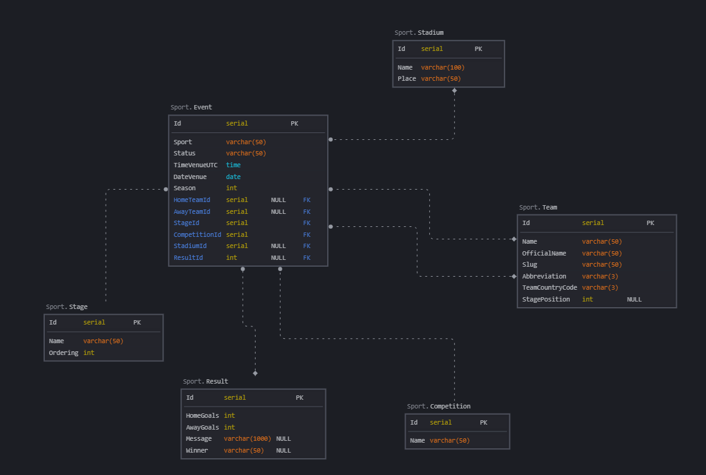

# SportApp

SportApp is an application that allows you to view sport events

## Technologies used

Angular 20
.NET Web API 8
PostgreSQL 18

## Installation
1. Clone the repository
```bash
git clone https://github.com/your-user/SportApp.git
```
2. Create a PostgreSQL database named "Sport" using this code:
```SQL
CREATE TABLE public.stadium (
    id SERIAL PRIMARY KEY,
    name VARCHAR(100) NOT NULL,
    place VARCHAR(50) NOT NULL
);

CREATE TABLE public.team (
    id SERIAL PRIMARY KEY,
    name VARCHAR(50) NOT NULL,
    official_name VARCHAR(50) NOT NULL,
    slug VARCHAR(50) NOT NULL,
    abbreviation VARCHAR(3) NOT NULL,
    team_country_code VARCHAR(3) NOT NULL,
    stage_position INT
);

CREATE TABLE public.stage (
    id SERIAL PRIMARY KEY,
    name VARCHAR(50) NOT NULL,
    ordering INT NOT NULL
);

CREATE TABLE public.competition (
    id SERIAL PRIMARY KEY,
    name VARCHAR(50) NOT NULL
);

CREATE TABLE public.result (
    id SERIAL PRIMARY KEY,
    home_goals INT NOT NULL,
    away_goals INT NOT NULL,
    message VARCHAR(1000),
    winner VARCHAR(50)
);

CREATE TABLE public.event (
    id SERIAL PRIMARY KEY,
    sport VARCHAR(50) NOT NULL,
    status VARCHAR(50) NOT NULL,
    timevenue_utc TIME NOT NULL,
    datevenue DATE NOT NULL,
    season INT NOT NULL,

    home_team_id INT,
    away_team_id INT,
    stage_id INT NOT NULL,
    competition_id INT NOT NULL,
    stadium_id INT,
    result_id INT,

    CONSTRAINT _fk_home_team
        FOREIGN KEY (home_team_id) REFERENCES public.team(id),

    CONSTRAINT _fk_away_team
        FOREIGN KEY (away_team_id) REFERENCES public.team(id),

    CONSTRAINT _fk_stage
        FOREIGN KEY (stage_id) REFERENCES public.stage(id),

    CONSTRAINT _fk_competition
        FOREIGN KEY (competition_id) REFERENCES public.competition(id),

    CONSTRAINT _fk_stadium
        FOREIGN KEY (stadium_id) REFERENCES public.stadium(id),

    CONSTRAINT _fk_result
        FOREIGN KEY (result_id) REFERENCES public.result(id)
);

INSERT INTO public.stadium (name, place) VALUES
('Redbull Arena', 'Salzburg'),
('Heidi-Horten-Arena', 'Klagenfurt');

INSERT INTO public.competition (name) VALUES
('Austrian Bundesliga'),
('ICE Hockey League');

INSERT INTO public.stage (name, ordering) VALUES
('League', 1),
('Group Stage', 1),
('Quarter-finals', 2),
('Semi-finals', 3),
('Final', 4);

INSERT INTO public.team (name, official_name, slug, abbreviation, team_country_code, stage_position) VALUES
('Salzburg', 'Red Bull Salzburg', 'red-bull-salzburg', 'SAL', 'AUT', NULL),
('Sturm', 'Sturm Graz', 'sturm-graz', 'STU', 'AUT', NULL),
('KAC', 'EC KAC', 'kac', 'KAC', 'AUT', NULL),
('Capitals', 'Vienna Capitals', 'vienna-capitals', 'CAP', 'AUT', NULL);

INSERT INTO public.result (home_goals, away_goals, message, winner) VALUES
(3, 0, 'Salzburg dominated the match', 'Salzburg');

INSERT INTO public.event (
    sport,
    status,
    timevenue_utc,
    datevenue,
    season,
    home_team_id,
    away_team_id,
    stage_id,
    competition_id,
    stadium_id,
    result_id
) VALUES
('Football', 'finished', '18:30:00', '2019-07-18', 2019, 1, 2, 1, 1, 1, 1),
('Ice hockey', 'scheduled', '09:45:00', '2019-10-23', 2019, 3, 4, 1, 2, 2, NULL);
}
```
3. Open the Sport.sln project in Visual Studio.
4. Set up the database connection – configure the connection in the appsettings.json file:
```json
‘ConnectionStrings’: {
  ‘DefaultConnection’: ‘Host=localhost;Port=5432;Database=Sport;Username=postgres;Password=yourpassword’
}
```
5. Run the API – Click Start (or use Ctrl + F5) in Visual Studio. The API should be listening on the address: https://localhost:7001 – If you change the address on your local machine, you must make changes to the Angular sport.service.ts:
```TypeScript

  getEvents(){
    return this.http.get<any[]>('{local-api-address}/api/Sport')
  }

  getEvent(id:number){
    return this.http.get<any>(`{local-api-address}/api/Sport/${id}`)
  }

  postEvent(event:any){
    return this.http.post<any>('{local-api-address}/api/Sport', event)
```
6. Navigate to the Angular directory
```powershell
cd SportAppAngular/SportAppAngular
```
7. Install frontend dependencies
```powershell
npm install
```
8. Run frontend
```powershell
ng serve
```

## ERD

